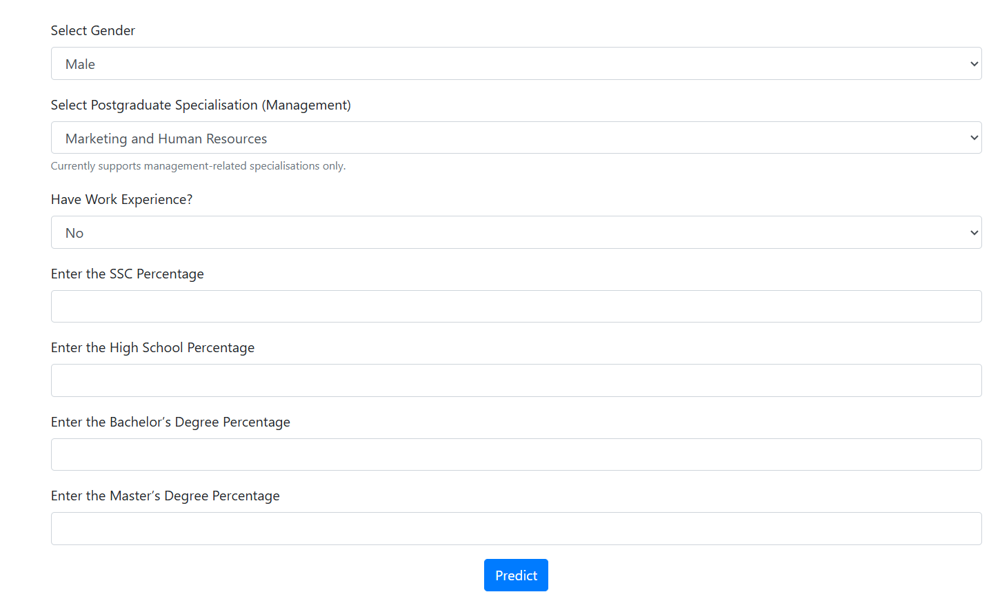
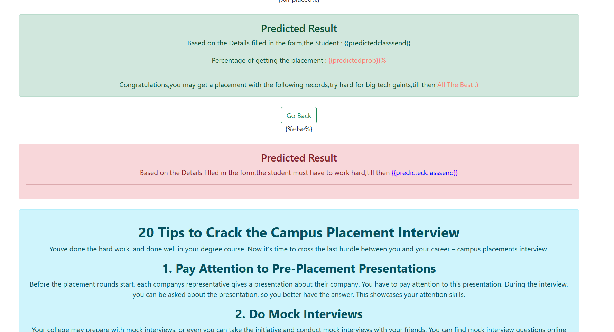

# 🚀 HireSense AI – Student Employability Prediction System

> An AI-powered machine learning system that predicts the probability of a student's campus placement based on academic performance and background factors.

---

## 📌 Project Overview

**HireSense AI** is a machine learning based employability prediction system that analyzes a student's academic profile and predicts their likelihood of securing a campus placement.

The system evaluates multiple academic indicators such as:

- SSC Percentage
- High School Percentage
- Bachelor's Degree Percentage
- Master's Degree Percentage
- Work Experience
- Specialization
- Gender

Using these features, the trained ML model predicts:

✔ Whether the student will get placed  
✔ Probability of getting placed

---

## 🧠 Machine Learning Workflow

The model learns patterns from historical placement datasets and uses them to estimate future placement chances.

---

# 📸 Project Screenshots

## 🖥️ Main Interface

---

## 📊 Student Input Form

Students enter their academic information to generate a placement prediction.

---

## 🎯 Prediction Result

The model returns:

- Placement prediction
- Probability of placement
- Recommendation message

---

# ⚙️ Features

✔ Clean and simple UI  
✔ Machine Learning prediction system  
✔ Probability based placement prediction  
✔ Academic performance analysis  
✔ Instant results  
✔ Interactive web interface

---

# 🧰 Tech Stack

### 👨‍💻 Programming

- Python

### 🤖 Machine Learning

- Scikit-learn
- Pandas
- NumPy

### 🌐 Web Framework

- Flask

### 🎨 Frontend

- HTML
- CSS
- Bootstrap

### 📊 Model

- Logistic Regression / Random Forest (depending on training)

---

# 🧪 Model Input Features

| Feature | Description |
|------|------|
| Gender | Male / Female |
| Specialization | MBA specialization |
| Work Experience | Yes / No |
| SSC Percentage | Class 10 marks |
| High School Percentage | Class 12 marks |
| Bachelor's Degree Percentage | Undergraduate score |
| Master's Degree Percentage | MBA score |

---

# 📈 Model Output

The system predicts:
